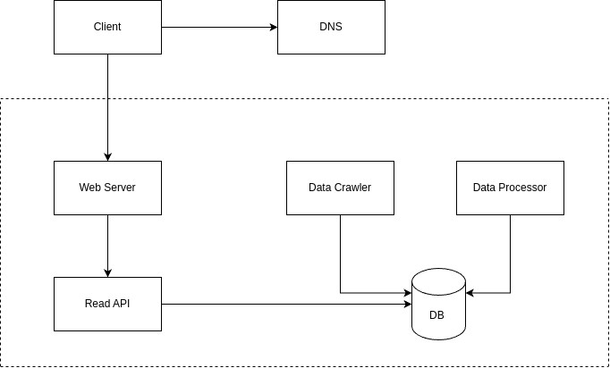

#Topic: Có 1 hệ thống gồm web fe, BE, mobile fe (android/ios) đang trong giai đoạn thử nghiệm, hoặc khách hàng rất ít tiền, đưa ra solution set up tiết kiệm nhất

## System Overview

### Mục tiêu hệ thống

Triển khai một hệ thống có chức năng crawl kết quả Chứng khoán, làm sạch và tiền xử lý dữ liệu sau đó lưu vào trong DB, phía BE sẽ cung cấp API để hiển thị đồ thị kết quả sau khi được xử lý.


### Kiến trúc hệ thống 




Hệ thống bao gồm các thành phần chính:
* DataCrawler: Phụ trách crawl data từ các sàn chứng khoán
* DataProcessor: Làm sạch và trích xuất các đặc trưng của dữ liệu 
* WebServer: Tiếp nhận các request truy xuất dữ liệu từ phía client 
* Database: Nơi lưu trữ các dữ liệu raw và dữ liệu sau khi được xử lý 

## Deployment
### Các bước tiến hành
Để deploy hệ thống này trên một server, cần thực hiện các bước như sau:
*   Thuê Server 
*   Mua domain 
*   Cấu hình DNS
*   Cài đặt các gói thư viện, phần mềm cần thiết
*   Cấu hình firewall
*   Đóng gói các service thành container sử dụng docker
*   Deploy service bằng docker compose 
*   Cấu hình nginx cho từng service 

### Thuê Server 
Vì hệ thống đang trong giai đoạn thử nghiệm/khách hàng ít tiền, nên sẽ ưu tiên lựa chọn các nhà cung cấp dịch vụ cloud computing giá rẻ hoặc miễn phí, có thể kể đến như:
*   AWS free Tier 
*   GG Cloud free Tier  
*   Heroku 
*   Firebase 
*   Vercel
*   Vultr
Trong phần thực hành này, do tác giả đã sử dụng hết free tier của AWS và GG cloud nên đã đăng kí thuê VPS trên Vultr, do chi phí thuê là rẻ nhất và chất lượng cũng không đến mức tệ. 

Lưu ý khi chọn thuê máy chủ, cần chọn những máy chủ  thuộc các region gần nhất với khách hàng. 

### Mua Domain 
Lựa chọn một nhà cung cấp tên miền, sau đó mua tên miền mà khách hàng mong muốn, ở đây tác giả lựa chọn nhà cung cấp tên miền là [godaddy](https://www.godaddy.com/) và tên miền là *beautyaiworld.com*.
### Cấu hình DNS
Tác giả sử dụng nhà cung cấp DNS là [cloudflare](https://www.cloudflare.com/) do họ cung cấp thêm một số dịch vụ miễn phí đi kèm như mail server và SSL.
* Trước tiên, cần chuyển tên miền mới mua khỏi godaddy: [Xem hướng dẫn tại đây](https://www.godaddy.com/vi-vn/help/chuyen-mien-cua-toi-khoi-godaddy-3560)
* Sau đó tiến hành transfer tên miền sang cloudflare: [Xem chi tiết tại đây](https://developers.cloudflare.com/registrar/get-started/tr
ansfer-domain-to-cloudflare/)
Bắt đâù tiến hành config DNS cho domain:
  * Sau khi đăng nhập vào cloudflare, cần nhập tên miền sau đó nhấn *Add site*: 
    
  * Tiếp đến, lựa chọn gói free cho phù hợp với túi tiền → *Confirm plan*:
    

  * Nhập địa chỉ server mới thuê vào mục Content ứng với cột Type A:
    
  * Cập nhật Nameservers cũ bằng cập Nameservers mới của cấu hình CloudFlare.:
    


Okey, đến bước này là cơ bản hoàn thành quá trình cấu hình DNS, tiếp đến là đăng kí dịch vụ cung cấp SSL free của cloudflare, bước này mọi người chịu khó tự tìm hiểu nhé :3

### Cài đặt các gói thư viện, phần mềm cần thiết

Chúng ta sẽ tiến hành cài đặt các thư viện và các gói cần thiết trên server mới này.
Với dự án này thì cần cài đặt các gói sau:
* Docker
* [Nginx](https://github.com/Trananh95/ops/tree/master/nginx)
* [Firewall](https://github.com/Trananh95/ops/tree/master/firewall)

### Thiết lập SSL cho domain
Để bảo mật thông tin truyền tải giữa client và server, chúng ta cần thiết lập SSL cho domain của mình. SSL có thể được thiết lập đơn giản bằng cách sử dụng certbot:  `sudo certbot certonly --manual --preferred-challenges dns --server https://acme-v02.api.letsencrypt.org/directory --agree-tos -d *.domainname.com`
khi đó certbot sẽ yêu cầu chúng ta thêm 1 bản ghi DNS TXT vào trong domain của chúng ta với giá trị định trước (chú ý là mỗi lần chạy sẽ gen ra một giá trị khác nhau). Việc này cũng không quá khó khăn, thao tác một chút tại màn hình quản lý domain:
 


### Cấu hình firewall

Sau khi đã cài đặt các gói cần thiết xong, bắt đầu tiến hành bảo mật cho server:

* Đầu tiên, chúng ta cần enable IPv6
* Disable ssh server bằng user/password:
  * Vào thư mục: `/etc/ssh/sshd_config`, tìm PasswordAuthentication  và set = ‘no’
  * Thay đổi gía trị default port ssh bằng giá trị khác, thay vì là port 22
  * Cuối cùng chạy câu lệnh: `sudo systemctl reload ssh` để lưu lại và thực thi cấu hình vừa thay đổi  
* Tiếp đến chúng ta sẽ deny mọi incoming connections và allow all outgoing connections, sau đó allow port PORT để phục vụ ssh đến server, chúng ta có thể chỉ allow port PORT từ một địa chỉ ip cụ thể để tăng thêm độ bảo mật.   
* Trong hệ thống này, tác giả sử dụng Nginx là web server, và API sử dụng port 8081, nên tác gỉa sẽ allow Nginx Full

Chi tiết việc cấu hình đọc giả có thể xem chi tiết [tại đây](https://github.com/Trananh95/ops/tree/master/firewall) 

### Deploy service bằng docker compose 


#### Deploy database
Trong hệ thống này, tác giả sử dụng database là mysql version 8.0 

```
version: "3.8"
services:
  mysql-stock:
    image: mysql:8.0
    container_name: mysql-stock
    restart: always                       # always restart
    environment:
      HI: "1"
      MYSQL_DATABASE: ''              # name of database
      MYSQL_USER: ''                # sample is the name of user
      MYSQL_PASSWORD: ''          # password for sample user
      MYSQL_ROOT_PASSWORD: ''     # password for root user
    ports:
      - '3306:3306'                       # host port 3306 is mapper to docker port 3306
    expose:
      - '3306'
        #command: --init-file /docker-entrypoint-initdb.d/stock.sql
    volumes:
      - /home/linuxuser/mysql/stock/db:/var/lib/mysql
      - /home/linuxuser/mysql/stock/data_dump:/docker-entrypoint-initdb.d
    networks:
      - stock

networks:
  stock:
    name: stock
    driver: bridge
      #external: true

```
Trong khi khởi tạo service mysql, tác giả cũng khởi tạo một docker network có tên là *stock* để các service khác kết nối với database thông qua network này
Tiếp đến chúng ta tiến hành deploy các service phía BE và crawler
```
version: "3.8"
services:
  stock-app:
    container_name: stock-app
    image: stock_app:0.0.0
    environment:
      PORT: 8081
      MYSQL_USER: 
      MYSQL_PASSWORD: 
      MYSQL_HOST: mysql-stock
      MYSQL_PORT: 3306
      MYSQL_DB: 
    ports:
      - 8081:8081
    networks:
      - stock
networks:
  stock:
    external: true
```
Service stock_app join cùng network stock với service database nên chúng ta chỉ cần khai báo host_name của mysql là tên container của service database là nó có thể tìm được địa chỉ ip của database để trỏ vào. 

### Cấu hình nginx cho từng service 
Bước cuối cùng chúng ta sẽ cấu hình nginx cho service API stock để client có thể request thông qua domain.
*   Đầu tiên, khởi tạo file /etc/nginx/sites-available/domain_name.conf
*   Fill thông tin sau vào file:
```
server {
     listen 80;
     listen [::]:80;
     listen 443 ;
     listen [::]:443;

     server_name domain_name www.domain_name;
     root /var/www/domain_name/html;
     index index.html index.htm index.nginx-debian.html;
     location / {
        proxy_pass http://127.0.0.1:8081;
        proxy_set_header Host $http_host;
        proxy_set_header X-Real-IP $remote_addr;
        proxy_set_header X-Forwarded-For $proxy_add_x_forwarded_for;
	      proxy_read_timeout 60s;
    }
     
}
```
*   Tiếp đến chạy lệnh sau để sym link file cấu hình sang thư mục site-enable của nginx
`sudo ln -s /etc/nginx/sites-available/domain_name.conf /etc/nginx/sites-enabled/`

*   Cuối cùng là chạy lệnh `sudo systemctl reload nginx` để chạy lại nginx

Và đây là thành quả cuối cùng [demo](https://earn.beautyaiworld.com/locornerpricechartview/chart/#)
