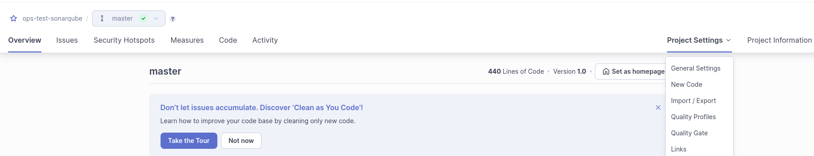

# Sonarqube

## Khái niệm
Sonarqube là một nền tảng mã nguồn mở được phát triển từ mười năm trước bởi SonarSource với mục đích kiểm tra liên tục chất lượng code, review của dự án bằng cách phân tích code để phát hiện các đoạn code không tốt, code lỗi hay những lỗ hổng bảo mật. Ngoài ra:

* Sonarqube được viết bằng ngôn ngữ Java nhưng nó có thể hỗ trợ vô số các ngôn ngữ lập trình khác nhau như Ruby, PHP, Java, Javascript, C#, C/C++, Go, Kotlin, ABAP, VB6, Python, Swift, HTML, CSS, XML, PL/SQL, VB.NET, RPG, Flex, COBOL, Objective-C,... và hỗ trợ các database giúp các kết quả MySQL, Postgresql được lưu trữ.
* Sonarqube thông qua plugin SonarLint được tích hợp vào các công cụ phát triển Visual Studio, Eclipse, IntelliJ IDEA và nhiều công cụ khác như Active Directory, LDAP, GitHup,...

## Lợi ích
Nói về lợi ích của Sonarqube, nó có khả năng quét tất cả các dòng code có trong dự án của bạn và dựa trên các coding standard tương ứng để đánh giá code của mọi ngôn ngữ trong dự án.

* Công cụ mã nguồn mở Sonarqube giúp bạn có thể kiểm tra chất lượng mã một cách liên tục với các báo cáo chi tiết về các bài kiểm tra đơn vị, tiêu chuẩn mã hoá, lỗ hổng bảo mật, độ phủ mã.
* Không chỉ có vậy, đây là công cụ giúp các lập trình viên có thể dễ dàng kiểm tra mức độ hiệu quả của mã code để nhanh chóng cảnh báo và đưa ra gợi ý chỉnh sửa ngay khi phát hiện lỗi vi phạm hay nguy cơ vi phạm những nguyên tắc chuẩn chung.
* Sonarqube giúp hình thành thói quen cho các lập trình viên và hạn chế tối đa các lỗi có thể xảy ra trong quá trình code.
* Sonarqube giúp giải quyết các vấn đề về quản lý chất lượng code, dirty code, code smell, technical debt hay những lỗ hổng bảo mật cho các dự án nhất là khi dự án đó có sự tham gia của đông đảo các thành viên với các trình độ, kinh nghiệm khác nhau.
* Sonarqube hỗ trợ báo cáo duplicated code, unit tests, comments, code coverage,...
* Nền tảng SonarSource có khả năng phân tích mã tĩnh và xác minh một cách chính xác chất lượng kỹ thuật của một mã nguồn.


Ngoài ra, so với code convention, Sonarqube có thể mang lại nhiều lợi ích cho bạn như:

* Khả năng phát hiện bug.
* Khả năng phát hiện code smell và duplicate.
* Tính toán chính xác mức độ bao phủ của Unit test và technical debt.
* So sánh chất lượng của các dòng code với những lần kiểm tra code trước.

## Cài đặt

Chúng ta có thể cài đặt sonarqube một cách đơn giản thông qua docker-compose file như sau:

```
version: "3"

services:
  sonarqube:
    image: sonarqube:community
    depends_on:
      - db
    environment:
      SONAR_JDBC_URL: jdbc:postgresql://db:5432/sonar
      SONAR_JDBC_USERNAME: sonar
      SONAR_JDBC_PASSWORD: sonar
      sonar.search.javaAdditionalOpts: -Dbootstrap.system_call_filter=false
    volumes:
      - ./sonarqube_data:/opt/sonarqube/data
      - ./sonarqube_extensions:/opt/sonarqube/extensions
      - ./sonarqube_logs:/opt/sonarqube/logs
    ports:
      - "9000:9000"
  db:
    image: postgres:15
    environment:
      POSTGRES_USER: sonar
      POSTGRES_PASSWORD: sonar
    volumes:
      - postgresql:/var/lib/postgresql
      - postgresql_data:/var/lib/postgresql/data

volumes:
  postgresql:
  postgresql_data:

```

Trong đó `sonarqube_data`, `sonarqube_extensions`, `sonarqube_logs` là 3 thư mục mà chúng ta cần tạo tại thư mục chứa docker-compose file

## Các khái niệm cơ bản
### Quality Gates
Quality Gates trong SonarQube là một tập hợp các tiêu chí mà một dự án phải đáp ứng để được coi là đạt tiêu chuẩn chất lượng hoặc sẵn sàng để phát hành. Chúng đóng vai trò như một biện pháp kiểm soát để duy trì các tiêu chuẩn chất lượng mã nguồn bằng cách chỉ định những điều kiện nào cần được đáp ứng.

Các thành phần chính của Quality Gates
1. Điều kiện: Đây là các quy tắc hoặc ngưỡng chỉ số mà một dự án phải đáp ứng. Các điều kiện có thể bao gồm:

*   Tỷ lệ bao phủ mã nguồn (code coverage) phải lớn hơn một mức cụ thể.
*   Số lỗi (bugs) tối đa cho phép.
*   Tỷ lệ trùng lặp mã nguồn tối đa cho phép.
*   Số lượng code smells (mã nguồn có mùi).
*   Lỗ hổng bảo mật và điểm nóng bảo mật.
2. Trạng thái: Một Quality Gate có thể có hai trạng thái:

*   Đạt (Màu xanh): Tất cả các điều kiện đã được đáp ứng.
*   Không đạt (Màu đỏ): Có một hoặc nhiều điều kiện không được đáp ứng.

Lợi ích của việc sử dụng Quality Gates:
* Ngăn chặn Nợ Kỹ Thuật (Technical Debt): Bằng cách áp đặt các điều kiện lên mã mới, các nhóm có thể tránh tích lũy nợ kỹ thuật.
* Đảm bảo Chất lượng Mã: Kiểm tra chất lượng liên tục đảm bảo chỉ có mã chất lượng cao được tích hợp vào nhánh chính.
* Phát hiện Sớm Vấn đề: Quality Gates giúp phát hiện các vấn đề sớm trong quá trình phát triển, giảm chi phí và công sức sửa lỗi sau này.
* Khuyến khích Thực hành Tốt nhất: Khuyến khích các nhà phát triển tuân theo các tiêu chuẩn mã hóa và thực hành tốt nhất.
#### Cách cấu hình Quality Gates trong SonarQube
1. Đi đến tab Quality Gates: Truy cập vào tab “Quality Gates” trong giao diện SonarQube.


2. Tạo mới hoặc chỉnh sửa Quality Gate: Bạn có thể tạo mới một quality gate hoặc chỉnh sửa một cái có sẵn bằng cách thêm hoặc chỉnh sửa các điều kiện.
3. Thiết lập các điều kiện: Định nghĩa các điều kiện dựa trên các chỉ số khác nhau như lỗi (bugs), lỗ hổng bảo mật (vulnerabilities), độ bao phủ mã (code coverage), v.v.

4. Áp dụng cho các dự án: Gán quality gate cho một hoặc nhiều dự án.

### Rule
Rules trong SonarQube là các tiêu chí được sử dụng để phân tích và đánh giá chất lượng mã nguồn. Mỗi rule mô tả một vấn đề tiềm ẩn trong mã và giải thích cách khắc phục nó. Rules giúp phát hiện các lỗi, vấn đề về bảo mật, code smells (các đoạn mã có mùi), và các vấn đề khác nhằm cải thiện chất lượng tổng thể của mã nguồn.

#### Các loại Rules trong SonarQube

1. Bugs (Lỗi):

* Rules thuộc loại này giúp phát hiện các lỗi logic trong mã có thể dẫn đến hành vi không mong muốn hoặc sai sót khi chạy chương trình.
* Ví dụ: sử dụng biến mà không được khởi tạo, hoặc so sánh một đối tượng với null khi điều đó không có ý nghĩa.

2. Vulnerabilities (Lỗ hổng bảo mật):

* Các rules này nhằm phát hiện các lỗ hổng bảo mật trong mã, giúp ngăn chặn các mối đe dọa bảo mật tiềm ẩn.
* Ví dụ: sử dụng các phương thức mã hóa yếu, hoặc không kiểm tra đầu vào từ người dùng.

3. Code Smells (Mã có mùi):

Đây là các vấn đề về chất lượng mã có thể không gây ra lỗi trực tiếp nhưng làm cho mã khó đọc, bảo trì hoặc dễ gây ra lỗi trong tương lai.
Ví dụ: phương thức quá dài, sử dụng tên biến không rõ ràng, hoặc cấu trúc mã không tối ưu.

4. Security hotspot:

Các rules này giúp xác định các điểm có thể có rủi ro bảo mật, nơi mã cần được xem xét kỹ lưỡng hơn. Đây không phải là lỗi bảo mật chắc chắn nhưng là những điểm cần quan tâm.

#### Cách hoạt động của Rules
* Kích hoạt và Cấu hình: Mỗi rule có thể được kích hoạt hoặc vô hiệu hóa tùy thuộc vào yêu cầu của dự án. Rules có thể được cấu hình để thay đổi mức độ nghiêm trọng (severity) của vấn đề từ thông tin (info), nhỏ (minor), lớn (major), quan trọng (critical), đến blocker.

* Profile (Hồ sơ): SonarQube sử dụng các hồ sơ quy tắc (rule profiles) để nhóm các rules lại với nhau. Mỗi ngôn ngữ lập trình sẽ có các profile mặc định mà người dùng có thể tùy chỉnh hoặc tạo mới.

#### Lợi ích của Rules
1. Phát hiện lỗi sớm: Giúp phát hiện các vấn đề về mã nguồn sớm trong quá trình phát triển, giảm chi phí sửa chữa và bảo trì sau này.
2. Tăng cường bảo mật: Phát hiện và khắc phục các lỗ hổng bảo mật trước khi mã được triển khai.
3. Cải thiện chất lượng mã: Khuyến khích tuân theo các thực hành tốt nhất trong viết mã và giúp giữ mã dễ đọc và bảo trì.
4. Tự động hóa kiểm tra chất lượng: Rules tự động kiểm tra mã khi quét, giảm thiểu yêu cầu kiểm tra thủ công.

#### Cách quản lý Rules trong SonarQube
1. Truy cập vào tab "Rules": Vào tab “Rules” trong giao diện SonarQube để xem tất cả các rules hiện có.


2. Chỉnh sửa Rules: Bạn có thể kích hoạt, vô hiệu hóa, hoặc thay đổi mức độ nghiêm trọng của các rules dựa trên yêu cầu của dự án.


3. Tạo profile quy tắc tùy chỉnh: Tạo hoặc chỉnh sửa các profile quy tắc để phù hợp với các tiêu chuẩn chất lượng mã của nhóm hoặc tổ chức.

## Sonar Scanner
SonarScanner là công cụ dòng lệnh được sử dụng để phân tích mã nguồn và gửi kết quả phân tích đó tới máy chủ SonarQube. Nó là thành phần chính của SonarQube để thực hiện phân tích mã nguồn tự động và cung cấp các thông tin chi tiết về chất lượng mã, bao gồm các lỗi tiềm ẩn, lỗi bảo mật, và vấn đề hiệu suất.

### Các đặc điểm chính của SonarScanner
1. Đa nền tảng: SonarScanner hoạt động trên nhiều hệ điều hành khác nhau như Windows, Linux, và macOS, và hỗ trợ nhiều ngôn ngữ lập trình như Java, JavaScript, Python, C#, PHP, v.v.

2. Độc lập với công cụ build: SonarScanner có thể chạy độc lập hoặc tích hợp với các công cụ build như Maven, Gradle, Ant, và MSBuild, hoặc thậm chí tích hợp vào các kịch bản CI/CD như Jenkins, GitLab CI, Azure DevOps, và nhiều nền tảng khác.

3. Cấu hình đơn giản: Để sử dụng SonarScanner, bạn chỉ cần cung cấp một số cấu hình cơ bản (chẳng hạn như địa chỉ máy chủ SonarQube, khóa dự án, và đường dẫn mã nguồn) thông qua file cấu hình hoặc thông số dòng lệnh.

### Cách sử dụng
1. Chuẩn bị môi trường: SonarScanner được cài đặt trên môi trường phát triển hoặc máy chủ CI/CD nơi mã nguồn cần được phân tích.

2. Cấu hình phân tích: Bạn cần tạo một file cấu hình sonar-project.properties thư mục root của project hoặc cung cấp các tham số cấu hình thông qua dòng lệnh. File này bao gồm các thông số như:

```
sonar.projectKey: Khóa dự án duy nhất trong SonarQube.
sonar.sources: Thư mục chứa mã nguồn cần phân tích.
sonar.host.url: URL của máy chủ SonarQube.
sonar.login: Token xác thực để truy cập SonarQube.
```
3. Thực thi phân tích: SonarScanner được chạy từ dòng lệnh hoặc tích hợp vào quy trình build, nó sẽ đọc các file mã nguồn, phân tích mã theo các quy tắc và profile được cấu hình trong SonarQube, và sau đó gửi kết quả lên máy chủ SonarQube.

4. Xử lý và hiển thị kết quả: Máy chủ SonarQube nhận kết quả phân tích từ SonarScanner, xử lý dữ liệu, và cung cấp thông tin chi tiết về chất lượng mã trên giao diện web của SonarQube.


## Tích hợp sonarqube với gitlab-ci

### Tạo project trên SonarQube
* Khởi tạo Project:


* Lựa chọn Project devops platform


* Chọn Gitlab repo cho Project:


* Tạo token cho Project 
* Cấu hình Project:



### Cấu hình Gitlab CI/CD pipeline

* Thêm biến môi trường của SonarQube vào git repo:
    SONAR_HOST_URL: URL của máy chủ SonarQube (ví dụ: http://your-sonarqube-server.com).
    SONAR_TOKEN: Token mà bạn đã tạo ở Bước 1.
* Cấu hình file .gitlab-ci.yml:
```
variables:
  SONAR_USER_HOME: "${CI_PROJECT_DIR}/.sonar"  # Defines the location of the analysis task cache
  GIT_DEPTH: "0"  # Tells git to fetch all the branches of the project, required by the analysis task

stages:
  - test
  - sonarqube-check

test-job:
  stage: test
  image:
    name: python:3.9
  script:
    - pip install -r requirements.txt
    - pytest --cov=. --cov-report xml

  artifacts:
    paths:
      - coverage.xml

sonarqube-check:
  image:
    name: sonarsource/sonar-scanner-cli:latest
    entrypoint: [ "" ]
  stage: sonarqube-check
  cache:
    policy: pull
    key: "${CI_COMMIT_SHORT_SHA}"
    paths:
      - sonar-scanner/
  dependencies:
    - test-job
  script:
    - sonar-scanner -Dsonar.projectKey=trananhbk_ops-test-sonarqube_091b03cd-2788-4cc7-bf1b-8ebbd3a50523 -Dsonar.sources=. -Dsonar.host.url=${SONAR_HOST_URL} -Dsonar.token=${SONAR_TOKEN}
  allow_failure: false
  rules:
    - if: $CI_PIPELINE_SOURCE == 'merge_request_event'
    - if: $CI_COMMIT_BRANCH == 'master'
    - if: $CI_COMMIT_BRANCH == 'main'
    - if: $CI_COMMIT_BRANCH == 'develop'
```
Trong ví dụ trên, chúng ta sử dụng SonarQube để quét một project python. Trong file gitlab-ci khai báo 2 stage là test và sonarqube-check.
* Stage test: Chạy unit test để xuất ra file report coverage của python
* Stage sonarqube-check: Phân tích code trong git repo và độ coverage code từ bước 1 để gửi phân tích đến sonarqube host.

Để share file coverage giữa 2 job trong gitlab ci, ta sử dụng từ khóa `artifacts`.
Để set status của gitlab pipline thành false khi phân tích code bằng sonarqube không đạt ta sử dụng từ khóa `allow_failure` và set bằng false.

* Kết quả:


